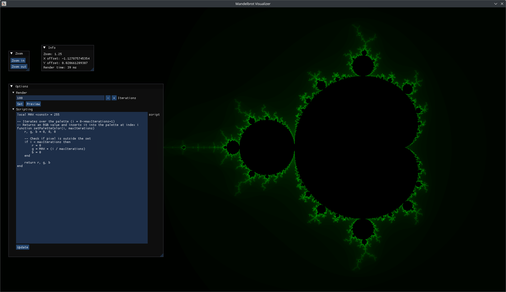

# fractal-explorer

A simple program for visualizing and coloring Mandelbrot fractals.

## Controls

- **Pan**: WASD or arrow keys
- **Zoom in**: +
- **Zoom out**: -
- **Toggle UI**: Tab
- **Take screenshot**: Space
